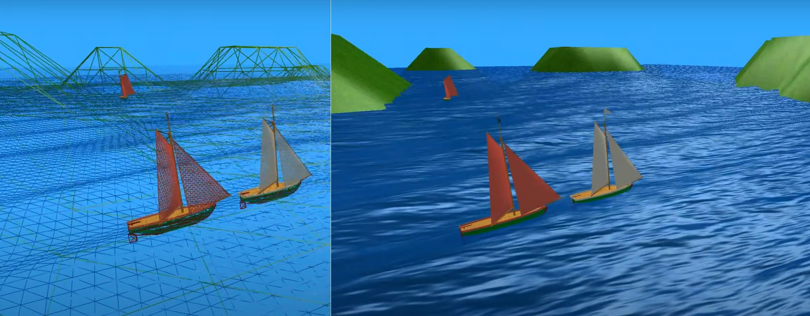

# SailingSim

This is an old sailing simulator game I created back in 2009-2010 as part of learning 3D graphics and game engines. This game is based on DirectX9 and I post it only for educational / historical reasons. Maybe someone would use its pieces for something. The source code has collision system, AI that drives NPC boats (with red sails), line of sight checks, waves/ocean simulation, skeletal animation, light, crafted 3D models, etc. 

This video shows some footage from this demo (fps was low due to bad screen grab):
[SailingSim demo](https://youtu.be/endW2KwM4lI)

The sailboat model is motivated by the real physics of sailing, but it is not 100% correct. The dynamical system only roughly approximates a real sailboat and is OK for games. But even with my simplifications, the model can tack realistically, can get stuck “in irons”, the wind can blow the boat backwards, etc. The game has a simple collision system, AI that drives NPC boats (with red sails), line of sight, wave/ocean simulation, skeletal animation, light, crafted 3D models, etc. 
AI controls NPC boats via action rollouts and selecting the best action (via global optimization over the control/goal function). It does not cheat and controls the same dynamical system as the player’s boat. The goal of the NPC boats is to catch the player’s boat with white sails. The demo uses older DirectX 9.0 and uses a basic framework that comes with DX9 code samples.

You can use this demo source code as you wish (with no warranty) for educational purposes or such. The code also includes pieces from UoW game related framework (some are not used around state machines). Shaders (in main dir) and models (in Data dir) were only tested with on Windows with DX9.
